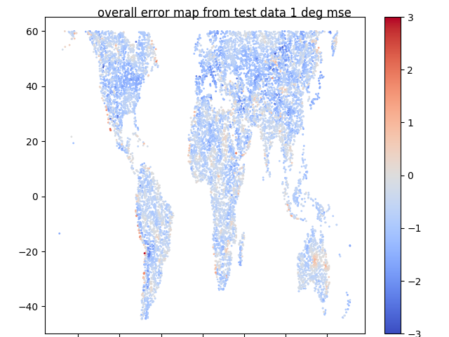
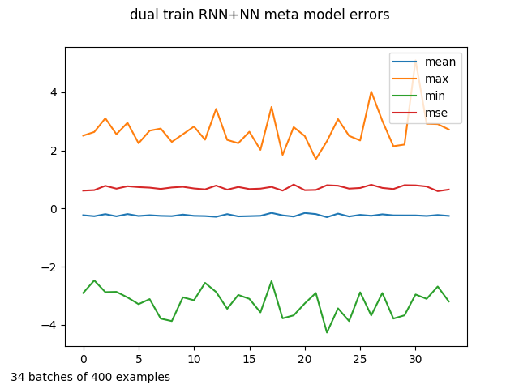

Using geotiff data to model climate with machine learning.

Tensorflow models are trained using climate data. The learned functions predict
average temperature at any location as a function of:

* vis radiation down
* TOA vis radiation (pure function of latitude) toa=top of atmosphere
* elevation
* barometric pressure as a function of elevation
* precipitation
* land or water or ice one hot
* hemisphere onehot
* albedo
* convolutions of surrounding area such as
   * NS and EW slope
   * STD of elevation

The  goal of this project is a validated differentiable function that can be used to determine climate sensitivity to greenhouse gas warming.

There are three models

1. A simple neural network using annual averages for up to 19 features, now abandoned.
2. A simple linear model, originally using only surface solar power and elevation, originally called stupidModel.  However it outperforms the neural net, especially after adding toa power ratio, i.e. surface solar power / toa power.  This ratio is a pretty good measure of greenhouse power magnitude. Given its [respectable] performance it has been renamed artisanal model ;)
3. A recurrent neural network (RNN) that takes monthly values for radiation at surface and toa plus precipitation and wind plus the annual averages as inputs and outputs a set of 12 monthly temperatures.
4, A meta neural net built with the 12 monthly temperature  outputs of the RNN plus the original 18 features.

### workflow

1. gt_ws_book.py looks at 20 pixel squares in the global solar atlas data files, which are 60N to 55S latitude.  Each square with valid data is assigned to be either a training or test example. output files saved in winstats folder

2. Batchers use the winstat data to  pick random 20 pixel squares from train or test data sets and then assemble the data from global solar atlas plus additional files from wc and essa data sets. wc_batcher.py includes worldclim monthly data  plus ESACCI-LC land code data which is used to calculate fraction of the pixel square that is land, water, and ice, with fractions summing to ~1.0.  Building a batch is kinda slow.  Lots of big geotif files being manipulated by python rasterio [which is awesome].  batch_savers save the batches with python pickle, which can be quickly read and marshalled up for training. Version 2 wc batcher corrects some scaling and qc check bugs

3. Trainers read the pickle files, build up the feeds and fetches, pass to tf.session.run(), print, save, and display results, and save trained models, or at least the ones worth saving. 

4. Testers run through batches and build a map of test data  with longitude and latitude for traceability  It performs a simple sensitivity test on each batch by adding a delta watts increment to surface solar channels and then measuring the resulting delta in temperature. The sensitivities are included in the map data set.  From the map  global scatter plots of test error and sensitivity are made with matplotlib as well as many other graphs  e.g. sensitivity and error versus latitude, elevation, surface power and toa power.

### metrics, data, and models

All models are wrong, some models are useful. For the purpose of determining climate sensitivity a validated model with less than 2.0 degrees C of mean squared error (MSE) is sure to be useful. The meta NN architecture is now at 1 degree C or better.

The graphs of errs for meta model maybe gives a better idea of model accuracy

|Model| MSE degree C|
|-----|-----------|
|NN       | 100   |
|Artisanal| 7-10  |
|RNN      |  1-3 |
|meta NN trained on wc temp | 0.7-1.1|
|meta NN trained on gsm temp | 0.9-1.2|

I was surprised at the awful performance of the pure neural net. I wanted additional features that  global solar does not have like precipitation, wind and surface type, i.e. land, water, or ice. The wc data was monthly so that led naturally to use  of a recurrent neural net, which is now very close to performance goal of less than 2 degrees C MSE.
Errors are largest in the temperate part of the northern hemisphere.  An obvious step to improve accuracy would be to add RNNS for northern and southern hemisphere or maybe 4 RNNs for North-South Tropics-Temperate.
The data is heavily biased toward land, though there are a few kilometers of data in the ocean around most coasts.  It is also northern hemisphere centric because there is much more land in northern hemisphere.  Use of bidirectional RNN helps avoid hemisphere confusions, though we still input hemisphere as a two wide NS onehot into both NN and RNN.

### data file drectrory tree

<pre>
tfc
-wcdat
--lc  #one file 5 second resolution
--prec  #12 files 30 second resolution
--srad  #12 files 30 second resolution
--tavg  #12 files 30 second resolution
--vapr  #12 files 30 second resolution
--wind  #12 files 30 second resolution
-ELE.tif # 30 second resolution
-GHI.tif  # 30 second resolution
-TEMP.tif  # 30 second resolution
</pre>

### data source citations

https://globalsolaratlas.info/downloads/world

https://www.esa-landcover-cci.org/

http://worldclim.org/version2

Fick, S.E. and R.J. Hijmans, 2017. Worldclim 2: New 1-km spatial resolution climate surfaces for global land areas. International Journal of Climatology.

