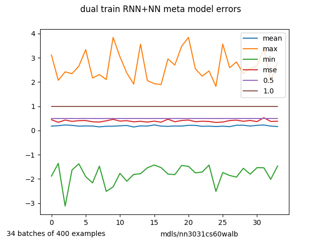

Using geotiff data to model climate with machine learning.

Tensorflow models are trained using climate data. The learned functions predict
average temperature at any location as a function of:

* longitude
* latitude
* vis radiation down monthly + annual
* TOA vis radiation monthly + annual toa=top of atmosphere
* elevation
* barometric pressure as a function of elevation
* precipitation monthly + annual
* land or water or ice distribution
* hemisphere onehot
* albedo
* wind monthly + annual
* convolutions of surrounding area such as
   * NS and EW slope (tbd)
   * STD of elevation
   * STD of surface vis

The  goal of this project is a validated differentiable function that can determine lower bounds to climate sensitivity to greenhouse gas warming. The stretch goal is to use the model with causal analysis methods of Judea Pearl to determine climate sensitivity or set some other bounds on climate sensitivity.

There are four models, first one now deleted

1. A simple neural network using annual averages for up to 19 features, now abandoned.
2. A simple linear model, originally using only surface solar power and elevation, originally called stupidModel.  However it outperforms the neural net, especially after adding toa power ratio, i.e. surface solar power / toa power.  This ratio is a pretty good measure of greenhouse power magnitude. Given its [respectable] performance it has been renamed artisanal model ;)
3. A recurrent neural network (RNN) that takes monthly values for radiation at surface and toa plus precipitation and wind plus the annual averages as inputs and outputs a set of 12 monthly temperatures.
4. A meta neural net built with the 12 monthly temperature  outputs of the RNN plus the original 18 features.

### workflow

New architecture with examples broken into climates zones is faster and more flexible than previous architecture.

1. with version Z gt_ws_book.py looks at 10 pixel squares in the global solar atlas data files,across all latitudes, saving each good example in folders per the earth's 6 climate zones.  Each square with valid data is assigned to be either a training or test example. output files saved in winstats folder

2. Batchers use the winstat data to pick random 10 pixel squared saved example files to build a batch from train or test data sets. Version Z with climates zones uses a new source for elevation the dem3 set of geotiff fields which provide full global coverage  plus ESACCI-LC land code data which is used to calculate fraction of the pixel square that is land, water, desert, and ice, with fractions summing to ~1.0. Version Z also include land slope, so the model knows if the example faces the sun.

3. Trainers  call the batcher and passes batch to the model to build feeds and fetches for  tf.session.run(), The also print, save, and display results, and save trained models, or at least the ones worth saving. 

4. Testers run through batches and build a map of test data  with longitude and latitude for traceability  It performs a simple sensitivity test on each batch by adding a delta watts increment to surface solar channels and then measuring the resulting delta in temperature. The sensitivities are included in the map data set.  From the map  global scatter plots of test error and sensitivity are made with matplotlib as well as many other graphs  e.g. sensitivity and error versus latitude, elevation, surface power and toa power.

### metrics, data, and models

The meta NN architecture is now at 1 degree C or better.

The graphs of errs for meta model maybe gives a better idea of model accuracy

|Model| MSE degree C|
|-----|-----------|
|NN       | 100   |
|Artisanal| 7-10  |
|RNN      |  1-2 |
|meta NN trained on wc temp | 0.4-0.55|
|meta NN trained on gsa temp | 0.8-1.2|

I was surprised at the awful performance of the pure neural net. I wanted additional features that global solar does not have like precipitation, wind and surface type, i.e. land, water, or ice. The wc data was monthly so that led naturally to use  of a recurrent neural net, which is now way belwo initial  performance goal of less than 2 degrees C MSE.

The data is heavily biased toward land, though there are a few kilometers of data in the ocean around most coasts.  It is also northern hemisphere centric because there is much more land in northern hemisphere.  Use of bidirectional RNN helps avoid hemisphere confusions, though we still input hemisphere as a two wide NS onehot into both NN and RNN.

The meta model shows no loss in accuracy between test data set and the last 1000 batches of training examples. At below 0.5 C its accuracy must be close to the accuracy of the data.

### data file drectrory tree

<pre>
tfc
-wcdat
--lc  #one file 5 second resolution
--prec  #12 files 30 second resolution
--srad  #12 files 30 second resolution
--tavg  #12 files 30 second resolution
--vapr  #12 files 30 second resolution
--wind  #12 files 30 second resolution
--dem3 #24 files 15 second resolution elevation
--lc  #1 files gloabl land cover 10 second resolution
</pre>

### data source citations

https://globalsolaratlas.info/downloads/world

https://www.esa-landcover-cci.org/

http://worldclim.org/version2

Fick, S.E. and R.J. Hijmans, 2017. Worldclim 2: New 1-km spatial resolution climate surfaces for global land areas. International Journal of Climatology.

https://rmets.onlinelibrary.wiley.com/doi/10.1002/joc.5086
